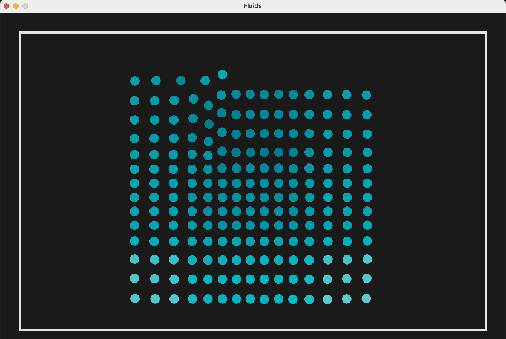

# Fluids
This project is an implementation of the concepts explored in this widely cited [paper](https://matthias-research.github.io/pages/publications/sca03.pdf) exploring particle-based fluid simulation. The main idea in this simulation is to calculate the acceleration of each particle at each step in time, and update the velocities and positions accordingly.

To run this project, clone it and enter `dotnet run` in the terminal. If you encounter a `Raylib_cs` not found error, then enter `dotnet add package Raylib-cs` in the terminal to install the package.

## Formulating Acceleration

When we simulate fluids computationally, we are forced to employ an Eulerian (grid based) approach, as we are forced to represent our space discretely. Thus, assuming temperature remains constant, fluids can be described by a velocity field $ v$, density field $\rho$ and a pressure field $p$. These quantities over time are governed by the following equations:

Conservation of mass:
    
$$
\frac{\partial \rho}{\partial t} + \nabla \cdot (\rho  v) = 0 \qquad(1)
$$
    
Conservation of momentum (formulated by the Navier-Stokes equation):
    
$$
\rho\left(\frac{\partial v}{\partial t} +  v \cdot \nabla  v\right) = -\nabla p + \rho g + \mu \nabla^2  v \qquad{(2)}
$$
    

Conveniently, since we model with a fixed number of particles of constant mass, mass is always conserved, and we do not need to worry about equation $(1)$ at all.

Note that the term $\frac{\partial  v}{\partial t} +  v \cdot \nabla  v$ is the substantial derivative, but as the particles move with the fluid this is simply the time derivative which means $ v \cdot \nabla  v$ vanishes. Therefore, with a little rearranging of $(2)$, we have the acceleration being

$$
 a = \frac{\text d v}{\text dt} = \frac{-\nabla p + \rho g + \mu \nabla^2  v }{\rho}
$$

To give an idea of the terms, the resultant force density field $-\nabla p + \rho g + \mu \nabla^2  v$ is the sum of contributions from the pressure, external force and viscosity respectively.

All that is left is to evaluate these quantities at the location of each particle.

## Smoothing Kernels

Since fluids take place in a continuous space in reality, and we are constrained to using a discrete space, we can mimic the properties of continuous space with interpolation. By using Smoothed Particle Hydrodynamics, we can evaluate a quantity $A$ at a point $ r$ by computing the weighted sum of contributions from all particles:

$$
A( r) = \sum_{j=1}^N m_j \frac{A_j}{\rho_j}W( r -  r_j, h)\qquad{(3)}
$$

where the function $W( r, h)$ is the **smoothing kernel** with smoothing radius $h$. As long as our kernel $W$ is even and normalised, our interpolation is of second-order accuracy and the formulation $(3)$ is useful, as derivatives only affect the smoothing kernel. That is to say, the gradient evaluates to

$$
\nabla A( r) = \sum_{j=1}^N m_j \frac{A_j}{\rho_j}\nabla W( r -  r_j, h)\qquad(4)
$$

and the Laplacian

$$
\nabla^2 A( r) = \sum_{j=1}^N m_j \frac{A_j}{\rho_j}\nabla^2 W( r -  r_j, h)\qquad(5)
$$

## Computing the terms

The pressure term $-\nabla p$ can be plugged into $(4)$ in place of $A$ to get

$$
-\nabla p( r_i) = -\sum_{j=1}^N m_j \frac{p_j}{\rho _j} \nabla W( r_i- r_j, h)
$$

However, Newton’s third law requires an equal and opposite force from the other particle in question, and the above does not preserve symmetry. Therefore, we can take the arithmetic mean as a simple solution.

$$
-\sum_{j=1}^N m_j \frac{p_i + p_j}{2\rho_j} \nabla W( r_i- r_j, h)
$$

Now to calculate $p$, we can modify the ideal gas state equation $p=k\rho$ to obtain

$$
p = k(\rho - \rho_0)
$$

where $k$ is a gas constant, signifying how aggressively we want to reach the rest density $\rho_0$.

The external force term is straightforward, we can set our value of gravity, say $g = (0, -9.81)^\top$ and we are done. If there are other external forces you wish to add (in my case, I added user interaction), then $g$ can be modified accordingly.

The viscosity term $\mu \nabla^2 v$ can be plugged into $(5)$ to get

$$
\mu\nabla^2 v( r_i) = \mu\sum_{j=1}^Nm_j \frac{ v_j}{\rho_j}\nabla^2W( r_i- r_j, h)
$$

which can be symmetrised (to satisfy viscosity’s dependence on velocity difference not absolute velocities) by using the velocity difference instead:

$$
\mu\sum_{j=1}^Nm_j \frac{ v_j -  v_i}{\rho_j}\nabla^2W( r_i- r_j, h)
$$

## Resources

[Coding Adventure: Simulating Fluids (Sebastian Lague)](https://www.youtube.com/watch?v=rSKMYc1CQHE)

[Particle-Based Fluid Simulation for Interactive Applications (M. Müller, D. Charypar and M. Gross)](https://matthias-research.github.io/pages/publications/sca03.pdf)

